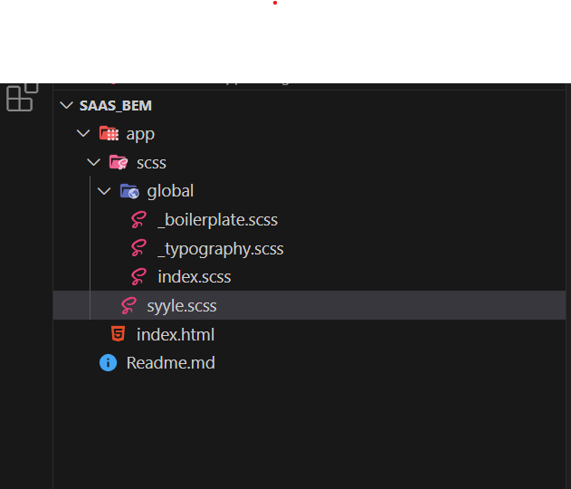
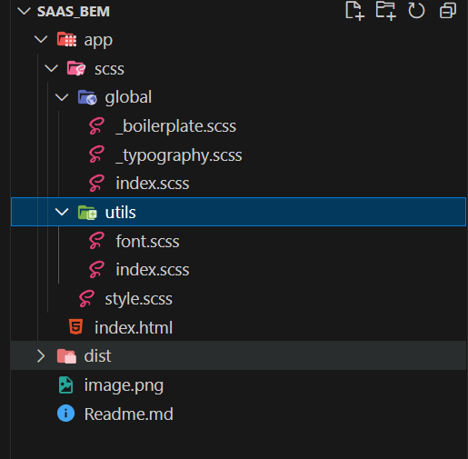

# Sass

## Compiling Sass with VS Code Extensions

To compile Sass using the Live Sass Server VS Code extension by Glenn Marks, follow these steps:

1. Install the extension - "Live Sass Server" by Glenn Marks.
2. Open settings by pressing `CTRL + SHIFT + P` and type "open settings(JSON)".

```json
{
   ... // Add below
    "liveSassCompile.settings.formats": [
        {
            "format": "expanded", // Change to compressed if you need to minify the Sass
            "extensionName": ".css",
            "savePath": null, // Change the path if you would like to save it in a desired location
            "savePathReplacementPairs": null
        }
    ]
}

```

Folow the folder structure format




# sass partials (different files)




## @forward and @use

### Sass Variables

Define variables using the `$` symbol, for example:

```css
$font: 'Comic Neue', cursive;
```


```css
@use "../utils"; // here

html {
    box-sizing: border-box;
    font-size: 100%;
}

*,
*::before,
*::after {
    box-sizing: inherit;
}

body {
    margin: 0;
    padding: 0;
    font-family: utils.$font; // here
    background-color: rgb(66, 66, 66);
    color: rgb(208, 208, 208);
}

```

## Breakpoints
Utilize Sass maps and mixins for handling breakpoints:

```css
$breakpoints: (
    small: 480px,
    medium: 768px,
    large: 1024px,
);

@mixin respond-to($breakpoint) {
    @media screen and (min-width: map-get($breakpoints, $breakpoint)) {
        @content;
    }
}

```


